# Final Project Submission
* Name : Kagiri Malvis Karuma
* Data Science Full Time
* Technical Mentors: Mark Tiba
* blog url: https://medium.com/@malvis.kagiri/7de0c3a69dbe

## Project Overview
For this project I will use exploratory data analysis to generate insights to a business stakeholder.


###                                                   Business Problem
Microsoft sees all the big companies creating original video content and they want to get in on the fun. They have decided to create a new movie studio, but they decide to create a movie studio, but they don’t know anything about creating movies.


###                                                   Objective
*	Explore the types of films in production and the different factors that aid in its production and success.
*	Translate these findings into actionable insights  

###                                                    Datasets
1.	tmdb.movies.csv 
2.	rt.movies_info.tsv
3.	tn.movie_budgets.csv
                                        
          

1. Import Libraries


```python
import pandas as pd
import numpy as np 
import matplotlib.pyplot as plt
```


```python
import seaborn as sns
```

2. Import Dataset


```python
#tmd.movies.csv
reviews = pd.read_csv("tmdb.movies.csv")
#rt.movies_info.tsv
rt = pd.read_table("rt.movie_info.tsv")
#tn.movie_budgets
budgets = pd.read_csv("tn.movie_budgets.csv")
#imbd_top_1000
net = pd.read_csv('imdb_top_1000.csv')
```

3. Explore the Datasets

###  tmd.movies.csv


```python
reviews.isnull().sum()
```


    Unnamed: 0           0
    genre_ids            0
    id                   0
    original_language    0
    original_title       0
    popularity           0
    release_date         0
    title                0
    vote_average         0
    vote_count           0
    dtype: int64


```python
reviews.head(10)
```


<div>
<style scoped>
    .dataframe tbody tr th:only-of-type {
        vertical-align: middle;
    }

    .dataframe tbody tr th {
        vertical-align: top;
    }

    .dataframe thead th {
        text-align: right;
    }
</style>
<table border="1" class="dataframe">
  <thead>
    <tr style="text-align: right;">
      <th></th>
      <th>Unnamed: 0</th>
      <th>genre_ids</th>
      <th>id</th>
      <th>original_language</th>
      <th>original_title</th>
      <th>popularity</th>
      <th>release_date</th>
      <th>title</th>
      <th>vote_average</th>
      <th>vote_count</th>
    </tr>
  </thead>
  <tbody>
    <tr>
      <th>0</th>
      <td>0</td>
      <td>[12, 14, 10751]</td>
      <td>12444</td>
      <td>en</td>
      <td>Harry Potter and the Deathly Hallows: Part 1</td>
      <td>33.533</td>
      <td>2010-11-19</td>
      <td>Harry Potter and the Deathly Hallows: Part 1</td>
      <td>7.7</td>
      <td>10788</td>
    </tr>
    <tr>
      <th>1</th>
      <td>1</td>
      <td>[14, 12, 16, 10751]</td>
      <td>10191</td>
      <td>en</td>
      <td>How to Train Your Dragon</td>
      <td>28.734</td>
      <td>2010-03-26</td>
      <td>How to Train Your Dragon</td>
      <td>7.7</td>
      <td>7610</td>
    </tr>
    <tr>
      <th>2</th>
      <td>2</td>
      <td>[12, 28, 878]</td>
      <td>10138</td>
      <td>en</td>
      <td>Iron Man 2</td>
      <td>28.515</td>
      <td>2010-05-07</td>
      <td>Iron Man 2</td>
      <td>6.8</td>
      <td>12368</td>
    </tr>
    <tr>
      <th>3</th>
      <td>3</td>
      <td>[16, 35, 10751]</td>
      <td>862</td>
      <td>en</td>
      <td>Toy Story</td>
      <td>28.005</td>
      <td>1995-11-22</td>
      <td>Toy Story</td>
      <td>7.9</td>
      <td>10174</td>
    </tr>
    <tr>
      <th>4</th>
      <td>4</td>
      <td>[28, 878, 12]</td>
      <td>27205</td>
      <td>en</td>
      <td>Inception</td>
      <td>27.920</td>
      <td>2010-07-16</td>
      <td>Inception</td>
      <td>8.3</td>
      <td>22186</td>
    </tr>
    <tr>
      <th>5</th>
      <td>5</td>
      <td>[12, 14, 10751]</td>
      <td>32657</td>
      <td>en</td>
      <td>Percy Jackson &amp; the Olympians: The Lightning T...</td>
      <td>26.691</td>
      <td>2010-02-11</td>
      <td>Percy Jackson &amp; the Olympians: The Lightning T...</td>
      <td>6.1</td>
      <td>4229</td>
    </tr>
    <tr>
      <th>6</th>
      <td>6</td>
      <td>[28, 12, 14, 878]</td>
      <td>19995</td>
      <td>en</td>
      <td>Avatar</td>
      <td>26.526</td>
      <td>2009-12-18</td>
      <td>Avatar</td>
      <td>7.4</td>
      <td>18676</td>
    </tr>
    <tr>
      <th>7</th>
      <td>7</td>
      <td>[16, 10751, 35]</td>
      <td>10193</td>
      <td>en</td>
      <td>Toy Story 3</td>
      <td>24.445</td>
      <td>2010-06-17</td>
      <td>Toy Story 3</td>
      <td>7.7</td>
      <td>8340</td>
    </tr>
    <tr>
      <th>8</th>
      <td>8</td>
      <td>[16, 10751, 35]</td>
      <td>20352</td>
      <td>en</td>
      <td>Despicable Me</td>
      <td>23.673</td>
      <td>2010-07-09</td>
      <td>Despicable Me</td>
      <td>7.2</td>
      <td>10057</td>
    </tr>
    <tr>
      <th>9</th>
      <td>9</td>
      <td>[16, 28, 35, 10751, 878]</td>
      <td>38055</td>
      <td>en</td>
      <td>Megamind</td>
      <td>22.855</td>
      <td>2010-11-04</td>
      <td>Megamind</td>
      <td>6.8</td>
      <td>3635</td>
    </tr>
  </tbody>
</table>
</div>


```python
reviews.tail(10)
```


<div>
<style scoped>
    .dataframe tbody tr th:only-of-type {
        vertical-align: middle;
    }

    .dataframe tbody tr th {
        vertical-align: top;
    }

    .dataframe thead th {
        text-align: right;
    }
</style>
<table border="1" class="dataframe">
  <thead>
    <tr style="text-align: right;">
      <th></th>
      <th>Unnamed: 0</th>
      <th>genre_ids</th>
      <th>id</th>
      <th>original_language</th>
      <th>original_title</th>
      <th>popularity</th>
      <th>release_date</th>
      <th>title</th>
      <th>vote_average</th>
      <th>vote_count</th>
    </tr>
  </thead>
  <tbody>
    <tr>
      <th>26507</th>
      <td>26507</td>
      <td>[99]</td>
      <td>545555</td>
      <td>ar</td>
      <td>Dreamaway</td>
      <td>0.6</td>
      <td>2018-10-14</td>
      <td>Dream Away</td>
      <td>0.0</td>
      <td>2</td>
    </tr>
    <tr>
      <th>26508</th>
      <td>26508</td>
      <td>[16]</td>
      <td>514492</td>
      <td>en</td>
      <td>Jaws</td>
      <td>0.6</td>
      <td>2018-05-29</td>
      <td>Jaws</td>
      <td>0.0</td>
      <td>1</td>
    </tr>
    <tr>
      <th>26509</th>
      <td>26509</td>
      <td>[27]</td>
      <td>502255</td>
      <td>en</td>
      <td>Closing Time</td>
      <td>0.6</td>
      <td>2018-02-24</td>
      <td>Closing Time</td>
      <td>0.0</td>
      <td>1</td>
    </tr>
    <tr>
      <th>26510</th>
      <td>26510</td>
      <td>[99]</td>
      <td>495045</td>
      <td>en</td>
      <td>Fail State</td>
      <td>0.6</td>
      <td>2018-10-19</td>
      <td>Fail State</td>
      <td>0.0</td>
      <td>1</td>
    </tr>
    <tr>
      <th>26511</th>
      <td>26511</td>
      <td>[99]</td>
      <td>492837</td>
      <td>en</td>
      <td>Making Filmmakers</td>
      <td>0.6</td>
      <td>2018-04-07</td>
      <td>Making Filmmakers</td>
      <td>0.0</td>
      <td>1</td>
    </tr>
    <tr>
      <th>26512</th>
      <td>26512</td>
      <td>[27, 18]</td>
      <td>488143</td>
      <td>en</td>
      <td>Laboratory Conditions</td>
      <td>0.6</td>
      <td>2018-10-13</td>
      <td>Laboratory Conditions</td>
      <td>0.0</td>
      <td>1</td>
    </tr>
    <tr>
      <th>26513</th>
      <td>26513</td>
      <td>[18, 53]</td>
      <td>485975</td>
      <td>en</td>
      <td>_EXHIBIT_84xxx_</td>
      <td>0.6</td>
      <td>2018-05-01</td>
      <td>_EXHIBIT_84xxx_</td>
      <td>0.0</td>
      <td>1</td>
    </tr>
    <tr>
      <th>26514</th>
      <td>26514</td>
      <td>[14, 28, 12]</td>
      <td>381231</td>
      <td>en</td>
      <td>The Last One</td>
      <td>0.6</td>
      <td>2018-10-01</td>
      <td>The Last One</td>
      <td>0.0</td>
      <td>1</td>
    </tr>
    <tr>
      <th>26515</th>
      <td>26515</td>
      <td>[10751, 12, 28]</td>
      <td>366854</td>
      <td>en</td>
      <td>Trailer Made</td>
      <td>0.6</td>
      <td>2018-06-22</td>
      <td>Trailer Made</td>
      <td>0.0</td>
      <td>1</td>
    </tr>
    <tr>
      <th>26516</th>
      <td>26516</td>
      <td>[53, 27]</td>
      <td>309885</td>
      <td>en</td>
      <td>The Church</td>
      <td>0.6</td>
      <td>2018-10-05</td>
      <td>The Church</td>
      <td>0.0</td>
      <td>1</td>
    </tr>
  </tbody>
</table>
</div>


```python
reviews.shape
```


    (26517, 10)


```python
reviews.info()
```

    <class 'pandas.core.frame.DataFrame'>
    RangeIndex: 26517 entries, 0 to 26516
    Data columns (total 10 columns):
     #   Column             Non-Null Count  Dtype  
    ---  ------             --------------  -----  
     0   Unnamed: 0         26517 non-null  int64  
     1   genre_ids          26517 non-null  object 
     2   id                 26517 non-null  int64  
     3   original_language  26517 non-null  object 
     4   original_title     26517 non-null  object 
     5   popularity         26517 non-null  float64
     6   release_date       26517 non-null  object 
     7   title              26517 non-null  object 
     8   vote_average       26517 non-null  float64
     9   vote_count         26517 non-null  int64  
    dtypes: float64(2), int64(3), object(5)
    memory usage: 2.0+ MB
    


```python
reviews.columns
```


    Index(['Unnamed: 0', 'genre_ids', 'id', 'original_language', 'original_title',
           'popularity', 'release_date', 'title', 'vote_average', 'vote_count'],
          dtype='object')


```python

```

### rt.movies_info.tsv


```python
rt.isnull().sum()
```


    id                 0
    synopsis          62
    rating             3
    genre              8
    director         199
    writer           449
    theater_date     359
    dvd_date         359
    currency        1220
    box_office      1220
    runtime           30
    studio          1066
    dtype: int64


```python
rt.head(10)
```


<div>
<style scoped>
    .dataframe tbody tr th:only-of-type {
        vertical-align: middle;
    }

    .dataframe tbody tr th {
        vertical-align: top;
    }

    .dataframe thead th {
        text-align: right;
    }
</style>
<table border="1" class="dataframe">
  <thead>
    <tr style="text-align: right;">
      <th></th>
      <th>id</th>
      <th>synopsis</th>
      <th>rating</th>
      <th>genre</th>
      <th>director</th>
      <th>writer</th>
      <th>theater_date</th>
      <th>dvd_date</th>
      <th>currency</th>
      <th>box_office</th>
      <th>runtime</th>
      <th>studio</th>
    </tr>
  </thead>
  <tbody>
    <tr>
      <th>0</th>
      <td>1</td>
      <td>This gritty, fast-paced, and innovative police...</td>
      <td>R</td>
      <td>Action and Adventure|Classics|Drama</td>
      <td>William Friedkin</td>
      <td>Ernest Tidyman</td>
      <td>Oct 9, 1971</td>
      <td>Sep 25, 2001</td>
      <td>NaN</td>
      <td>NaN</td>
      <td>104 minutes</td>
      <td>NaN</td>
    </tr>
    <tr>
      <th>1</th>
      <td>3</td>
      <td>New York City, not-too-distant-future: Eric Pa...</td>
      <td>R</td>
      <td>Drama|Science Fiction and Fantasy</td>
      <td>David Cronenberg</td>
      <td>David Cronenberg|Don DeLillo</td>
      <td>Aug 17, 2012</td>
      <td>Jan 1, 2013</td>
      <td>$</td>
      <td>600,000</td>
      <td>108 minutes</td>
      <td>Entertainment One</td>
    </tr>
    <tr>
      <th>2</th>
      <td>5</td>
      <td>Illeana Douglas delivers a superb performance ...</td>
      <td>R</td>
      <td>Drama|Musical and Performing Arts</td>
      <td>Allison Anders</td>
      <td>Allison Anders</td>
      <td>Sep 13, 1996</td>
      <td>Apr 18, 2000</td>
      <td>NaN</td>
      <td>NaN</td>
      <td>116 minutes</td>
      <td>NaN</td>
    </tr>
    <tr>
      <th>3</th>
      <td>6</td>
      <td>Michael Douglas runs afoul of a treacherous su...</td>
      <td>R</td>
      <td>Drama|Mystery and Suspense</td>
      <td>Barry Levinson</td>
      <td>Paul Attanasio|Michael Crichton</td>
      <td>Dec 9, 1994</td>
      <td>Aug 27, 1997</td>
      <td>NaN</td>
      <td>NaN</td>
      <td>128 minutes</td>
      <td>NaN</td>
    </tr>
    <tr>
      <th>4</th>
      <td>7</td>
      <td>NaN</td>
      <td>NR</td>
      <td>Drama|Romance</td>
      <td>Rodney Bennett</td>
      <td>Giles Cooper</td>
      <td>NaN</td>
      <td>NaN</td>
      <td>NaN</td>
      <td>NaN</td>
      <td>200 minutes</td>
      <td>NaN</td>
    </tr>
    <tr>
      <th>5</th>
      <td>8</td>
      <td>The year is 1942. As the Allies unite overseas...</td>
      <td>PG</td>
      <td>Drama|Kids and Family</td>
      <td>Jay Russell</td>
      <td>Gail Gilchriest</td>
      <td>Mar 3, 2000</td>
      <td>Jul 11, 2000</td>
      <td>NaN</td>
      <td>NaN</td>
      <td>95 minutes</td>
      <td>Warner Bros. Pictures</td>
    </tr>
    <tr>
      <th>6</th>
      <td>10</td>
      <td>Some cast and crew from NBC's highly acclaimed...</td>
      <td>PG-13</td>
      <td>Comedy</td>
      <td>Jake Kasdan</td>
      <td>Mike White</td>
      <td>Jan 11, 2002</td>
      <td>Jun 18, 2002</td>
      <td>$</td>
      <td>41,032,915</td>
      <td>82 minutes</td>
      <td>Paramount Pictures</td>
    </tr>
    <tr>
      <th>7</th>
      <td>13</td>
      <td>Stewart Kane, an Irishman living in the Austra...</td>
      <td>R</td>
      <td>Drama</td>
      <td>Ray Lawrence</td>
      <td>Raymond Carver|Beatrix Christian</td>
      <td>Apr 27, 2006</td>
      <td>Oct 2, 2007</td>
      <td>$</td>
      <td>224,114</td>
      <td>123 minutes</td>
      <td>Sony Pictures Classics</td>
    </tr>
    <tr>
      <th>8</th>
      <td>14</td>
      <td>"Love Ranch" is a bittersweet love story that ...</td>
      <td>R</td>
      <td>Drama</td>
      <td>Taylor Hackford</td>
      <td>Mark Jacobson</td>
      <td>Jun 30, 2010</td>
      <td>Nov 9, 2010</td>
      <td>$</td>
      <td>134,904</td>
      <td>117 minutes</td>
      <td>NaN</td>
    </tr>
    <tr>
      <th>9</th>
      <td>15</td>
      <td>When a diamond expedition in the Congo is lost...</td>
      <td>PG-13</td>
      <td>Action and Adventure|Mystery and Suspense|Scie...</td>
      <td>Frank Marshall</td>
      <td>John Patrick Shanley</td>
      <td>Jun 9, 1995</td>
      <td>Jul 27, 1999</td>
      <td>NaN</td>
      <td>NaN</td>
      <td>108 minutes</td>
      <td>NaN</td>
    </tr>
  </tbody>
</table>
</div>


```python
rt.shape
```


    (1560, 12)


```python
rt.info()
```

    <class 'pandas.core.frame.DataFrame'>
    RangeIndex: 1560 entries, 0 to 1559
    Data columns (total 12 columns):
     #   Column        Non-Null Count  Dtype 
    ---  ------        --------------  ----- 
     0   id            1560 non-null   int64 
     1   synopsis      1498 non-null   object
     2   rating        1557 non-null   object
     3   genre         1552 non-null   object
     4   director      1361 non-null   object
     5   writer        1111 non-null   object
     6   theater_date  1201 non-null   object
     7   dvd_date      1201 non-null   object
     8   currency      340 non-null    object
     9   box_office    340 non-null    object
     10  runtime       1530 non-null   object
     11  studio        494 non-null    object
    dtypes: int64(1), object(11)
    memory usage: 146.4+ KB
    


```python
rt.columns
```


    Index(['id', 'synopsis', 'rating', 'genre', 'director', 'writer',
           'theater_date', 'dvd_date', 'currency', 'box_office', 'runtime',
           'studio'],
          dtype='object')


```python

```

### tn.movie_budgets.csv


```python
budgets.isnull().sum()
```


    id                   0
    release_date         0
    movie                0
    production_budget    0
    domestic_gross       0
    worldwide_gross      0
    dtype: int64


```python
budgets.columns
```


    Index(['id', 'release_date', 'movie', 'production_budget', 'domestic_gross',
           'worldwide_gross'],
          dtype='object')


```python
budgets.shape
```


    (5782, 6)


```python
budgets.head(10)
```


<div>
<style scoped>
    .dataframe tbody tr th:only-of-type {
        vertical-align: middle;
    }

    .dataframe tbody tr th {
        vertical-align: top;
    }

    .dataframe thead th {
        text-align: right;
    }
</style>
<table border="1" class="dataframe">
  <thead>
    <tr style="text-align: right;">
      <th></th>
      <th>id</th>
      <th>release_date</th>
      <th>movie</th>
      <th>production_budget</th>
      <th>domestic_gross</th>
      <th>worldwide_gross</th>
    </tr>
  </thead>
  <tbody>
    <tr>
      <th>0</th>
      <td>1</td>
      <td>Dec 18, 2009</td>
      <td>Avatar</td>
      <td>$425,000,000</td>
      <td>$760,507,625</td>
      <td>$2,776,345,279</td>
    </tr>
    <tr>
      <th>1</th>
      <td>2</td>
      <td>May 20, 2011</td>
      <td>Pirates of the Caribbean: On Stranger Tides</td>
      <td>$410,600,000</td>
      <td>$241,063,875</td>
      <td>$1,045,663,875</td>
    </tr>
    <tr>
      <th>2</th>
      <td>3</td>
      <td>Jun 7, 2019</td>
      <td>Dark Phoenix</td>
      <td>$350,000,000</td>
      <td>$42,762,350</td>
      <td>$149,762,350</td>
    </tr>
    <tr>
      <th>3</th>
      <td>4</td>
      <td>May 1, 2015</td>
      <td>Avengers: Age of Ultron</td>
      <td>$330,600,000</td>
      <td>$459,005,868</td>
      <td>$1,403,013,963</td>
    </tr>
    <tr>
      <th>4</th>
      <td>5</td>
      <td>Dec 15, 2017</td>
      <td>Star Wars Ep. VIII: The Last Jedi</td>
      <td>$317,000,000</td>
      <td>$620,181,382</td>
      <td>$1,316,721,747</td>
    </tr>
    <tr>
      <th>5</th>
      <td>6</td>
      <td>Dec 18, 2015</td>
      <td>Star Wars Ep. VII: The Force Awakens</td>
      <td>$306,000,000</td>
      <td>$936,662,225</td>
      <td>$2,053,311,220</td>
    </tr>
    <tr>
      <th>6</th>
      <td>7</td>
      <td>Apr 27, 2018</td>
      <td>Avengers: Infinity War</td>
      <td>$300,000,000</td>
      <td>$678,815,482</td>
      <td>$2,048,134,200</td>
    </tr>
    <tr>
      <th>7</th>
      <td>8</td>
      <td>May 24, 2007</td>
      <td>Pirates of the Caribbean: At World’s End</td>
      <td>$300,000,000</td>
      <td>$309,420,425</td>
      <td>$963,420,425</td>
    </tr>
    <tr>
      <th>8</th>
      <td>9</td>
      <td>Nov 17, 2017</td>
      <td>Justice League</td>
      <td>$300,000,000</td>
      <td>$229,024,295</td>
      <td>$655,945,209</td>
    </tr>
    <tr>
      <th>9</th>
      <td>10</td>
      <td>Nov 6, 2015</td>
      <td>Spectre</td>
      <td>$300,000,000</td>
      <td>$200,074,175</td>
      <td>$879,620,923</td>
    </tr>
  </tbody>
</table>
</div>


## imdb_top_1000.csv


```python
net.info()
```

    <class 'pandas.core.frame.DataFrame'>
    RangeIndex: 1000 entries, 0 to 999
    Data columns (total 16 columns):
     #   Column         Non-Null Count  Dtype  
    ---  ------         --------------  -----  
     0   Poster_Link    1000 non-null   object 
     1   Series_Title   1000 non-null   object 
     2   Released_Year  1000 non-null   object 
     3   Certificate    899 non-null    object 
     4   Runtime        1000 non-null   object 
     5   Genre          1000 non-null   object 
     6   IMDB_Rating    1000 non-null   float64
     7   Overview       1000 non-null   object 
     8   Meta_score     843 non-null    float64
     9   Director       1000 non-null   object 
     10  Star1          1000 non-null   object 
     11  Star2          1000 non-null   object 
     12  Star3          1000 non-null   object 
     13  Star4          1000 non-null   object 
     14  No_of_Votes    1000 non-null   int64  
     15  Gross          831 non-null    object 
    dtypes: float64(2), int64(1), object(13)
    memory usage: 125.1+ KB
    


```python
net.describe()
```


<div>
<style scoped>
    .dataframe tbody tr th:only-of-type {
        vertical-align: middle;
    }

    .dataframe tbody tr th {
        vertical-align: top;
    }

    .dataframe thead th {
        text-align: right;
    }
</style>
<table border="1" class="dataframe">
  <thead>
    <tr style="text-align: right;">
      <th></th>
      <th>IMDB_Rating</th>
      <th>Meta_score</th>
      <th>No_of_Votes</th>
    </tr>
  </thead>
  <tbody>
    <tr>
      <th>count</th>
      <td>1000.000000</td>
      <td>843.000000</td>
      <td>1.000000e+03</td>
    </tr>
    <tr>
      <th>mean</th>
      <td>7.949300</td>
      <td>77.971530</td>
      <td>2.736929e+05</td>
    </tr>
    <tr>
      <th>std</th>
      <td>0.275491</td>
      <td>12.376099</td>
      <td>3.273727e+05</td>
    </tr>
    <tr>
      <th>min</th>
      <td>7.600000</td>
      <td>28.000000</td>
      <td>2.508800e+04</td>
    </tr>
    <tr>
      <th>25%</th>
      <td>7.700000</td>
      <td>70.000000</td>
      <td>5.552625e+04</td>
    </tr>
    <tr>
      <th>50%</th>
      <td>7.900000</td>
      <td>79.000000</td>
      <td>1.385485e+05</td>
    </tr>
    <tr>
      <th>75%</th>
      <td>8.100000</td>
      <td>87.000000</td>
      <td>3.741612e+05</td>
    </tr>
    <tr>
      <th>max</th>
      <td>9.300000</td>
      <td>100.000000</td>
      <td>2.343110e+06</td>
    </tr>
  </tbody>
</table>
</div>


```python
net.columns
```


    Index(['Poster_Link', 'Series_Title', 'Released_Year', 'Certificate',
           'Runtime', 'Genre', 'IMDB_Rating', 'Overview', 'Meta_score', 'Director',
           'Star1', 'Star2', 'Star3', 'Star4', 'No_of_Votes', 'Gross'],
          dtype='object')


```python
net.head(10)
```


<div>
<style scoped>
    .dataframe tbody tr th:only-of-type {
        vertical-align: middle;
    }

    .dataframe tbody tr th {
        vertical-align: top;
    }

    .dataframe thead th {
        text-align: right;
    }
</style>
<table border="1" class="dataframe">
  <thead>
    <tr style="text-align: right;">
      <th></th>
      <th>Poster_Link</th>
      <th>Series_Title</th>
      <th>Released_Year</th>
      <th>Certificate</th>
      <th>Runtime</th>
      <th>Genre</th>
      <th>IMDB_Rating</th>
      <th>Overview</th>
      <th>Meta_score</th>
      <th>Director</th>
      <th>Star1</th>
      <th>Star2</th>
      <th>Star3</th>
      <th>Star4</th>
      <th>No_of_Votes</th>
      <th>Gross</th>
    </tr>
  </thead>
  <tbody>
    <tr>
      <th>0</th>
      <td>https://m.media-amazon.com/images/M/MV5BMDFkYT...</td>
      <td>The Shawshank Redemption</td>
      <td>1994</td>
      <td>A</td>
      <td>142 min</td>
      <td>Drama</td>
      <td>9.3</td>
      <td>Two imprisoned men bond over a number of years...</td>
      <td>80.0</td>
      <td>Frank Darabont</td>
      <td>Tim Robbins</td>
      <td>Morgan Freeman</td>
      <td>Bob Gunton</td>
      <td>William Sadler</td>
      <td>2343110</td>
      <td>28,341,469</td>
    </tr>
    <tr>
      <th>1</th>
      <td>https://m.media-amazon.com/images/M/MV5BM2MyNj...</td>
      <td>The Godfather</td>
      <td>1972</td>
      <td>A</td>
      <td>175 min</td>
      <td>Crime, Drama</td>
      <td>9.2</td>
      <td>An organized crime dynasty's aging patriarch t...</td>
      <td>100.0</td>
      <td>Francis Ford Coppola</td>
      <td>Marlon Brando</td>
      <td>Al Pacino</td>
      <td>James Caan</td>
      <td>Diane Keaton</td>
      <td>1620367</td>
      <td>134,966,411</td>
    </tr>
    <tr>
      <th>2</th>
      <td>https://m.media-amazon.com/images/M/MV5BMTMxNT...</td>
      <td>The Dark Knight</td>
      <td>2008</td>
      <td>UA</td>
      <td>152 min</td>
      <td>Action, Crime, Drama</td>
      <td>9.0</td>
      <td>When the menace known as the Joker wreaks havo...</td>
      <td>84.0</td>
      <td>Christopher Nolan</td>
      <td>Christian Bale</td>
      <td>Heath Ledger</td>
      <td>Aaron Eckhart</td>
      <td>Michael Caine</td>
      <td>2303232</td>
      <td>534,858,444</td>
    </tr>
    <tr>
      <th>3</th>
      <td>https://m.media-amazon.com/images/M/MV5BMWMwMG...</td>
      <td>The Godfather: Part II</td>
      <td>1974</td>
      <td>A</td>
      <td>202 min</td>
      <td>Crime, Drama</td>
      <td>9.0</td>
      <td>The early life and career of Vito Corleone in ...</td>
      <td>90.0</td>
      <td>Francis Ford Coppola</td>
      <td>Al Pacino</td>
      <td>Robert De Niro</td>
      <td>Robert Duvall</td>
      <td>Diane Keaton</td>
      <td>1129952</td>
      <td>57,300,000</td>
    </tr>
    <tr>
      <th>4</th>
      <td>https://m.media-amazon.com/images/M/MV5BMWU4N2...</td>
      <td>12 Angry Men</td>
      <td>1957</td>
      <td>U</td>
      <td>96 min</td>
      <td>Crime, Drama</td>
      <td>9.0</td>
      <td>A jury holdout attempts to prevent a miscarria...</td>
      <td>96.0</td>
      <td>Sidney Lumet</td>
      <td>Henry Fonda</td>
      <td>Lee J. Cobb</td>
      <td>Martin Balsam</td>
      <td>John Fiedler</td>
      <td>689845</td>
      <td>4,360,000</td>
    </tr>
    <tr>
      <th>5</th>
      <td>https://m.media-amazon.com/images/M/MV5BNzA5ZD...</td>
      <td>The Lord of the Rings: The Return of the King</td>
      <td>2003</td>
      <td>U</td>
      <td>201 min</td>
      <td>Action, Adventure, Drama</td>
      <td>8.9</td>
      <td>Gandalf and Aragorn lead the World of Men agai...</td>
      <td>94.0</td>
      <td>Peter Jackson</td>
      <td>Elijah Wood</td>
      <td>Viggo Mortensen</td>
      <td>Ian McKellen</td>
      <td>Orlando Bloom</td>
      <td>1642758</td>
      <td>377,845,905</td>
    </tr>
    <tr>
      <th>6</th>
      <td>https://m.media-amazon.com/images/M/MV5BNGNhMD...</td>
      <td>Pulp Fiction</td>
      <td>1994</td>
      <td>A</td>
      <td>154 min</td>
      <td>Crime, Drama</td>
      <td>8.9</td>
      <td>The lives of two mob hitmen, a boxer, a gangst...</td>
      <td>94.0</td>
      <td>Quentin Tarantino</td>
      <td>John Travolta</td>
      <td>Uma Thurman</td>
      <td>Samuel L. Jackson</td>
      <td>Bruce Willis</td>
      <td>1826188</td>
      <td>107,928,762</td>
    </tr>
    <tr>
      <th>7</th>
      <td>https://m.media-amazon.com/images/M/MV5BNDE4OT...</td>
      <td>Schindler's List</td>
      <td>1993</td>
      <td>A</td>
      <td>195 min</td>
      <td>Biography, Drama, History</td>
      <td>8.9</td>
      <td>In German-occupied Poland during World War II,...</td>
      <td>94.0</td>
      <td>Steven Spielberg</td>
      <td>Liam Neeson</td>
      <td>Ralph Fiennes</td>
      <td>Ben Kingsley</td>
      <td>Caroline Goodall</td>
      <td>1213505</td>
      <td>96,898,818</td>
    </tr>
    <tr>
      <th>8</th>
      <td>https://m.media-amazon.com/images/M/MV5BMjAxMz...</td>
      <td>Inception</td>
      <td>2010</td>
      <td>UA</td>
      <td>148 min</td>
      <td>Action, Adventure, Sci-Fi</td>
      <td>8.8</td>
      <td>A thief who steals corporate secrets through t...</td>
      <td>74.0</td>
      <td>Christopher Nolan</td>
      <td>Leonardo DiCaprio</td>
      <td>Joseph Gordon-Levitt</td>
      <td>Elliot Page</td>
      <td>Ken Watanabe</td>
      <td>2067042</td>
      <td>292,576,195</td>
    </tr>
    <tr>
      <th>9</th>
      <td>https://m.media-amazon.com/images/M/MV5BMmEzNT...</td>
      <td>Fight Club</td>
      <td>1999</td>
      <td>A</td>
      <td>139 min</td>
      <td>Drama</td>
      <td>8.8</td>
      <td>An insomniac office worker and a devil-may-car...</td>
      <td>66.0</td>
      <td>David Fincher</td>
      <td>Brad Pitt</td>
      <td>Edward Norton</td>
      <td>Meat Loaf</td>
      <td>Zach Grenier</td>
      <td>1854740</td>
      <td>37,030,102</td>
    </tr>
  </tbody>
</table>
</div>


```python
net.tail(10)
```


<div>
<style scoped>
    .dataframe tbody tr th:only-of-type {
        vertical-align: middle;
    }

    .dataframe tbody tr th {
        vertical-align: top;
    }

    .dataframe thead th {
        text-align: right;
    }
</style>
<table border="1" class="dataframe">
  <thead>
    <tr style="text-align: right;">
      <th></th>
      <th>Poster_Link</th>
      <th>Series_Title</th>
      <th>Released_Year</th>
      <th>Certificate</th>
      <th>Runtime</th>
      <th>Genre</th>
      <th>IMDB_Rating</th>
      <th>Overview</th>
      <th>Meta_score</th>
      <th>Director</th>
      <th>Star1</th>
      <th>Star2</th>
      <th>Star3</th>
      <th>Star4</th>
      <th>No_of_Votes</th>
      <th>Gross</th>
    </tr>
  </thead>
  <tbody>
    <tr>
      <th>990</th>
      <td>https://m.media-amazon.com/images/M/MV5BYjRmY2...</td>
      <td>Giù la testa</td>
      <td>1971</td>
      <td>PG</td>
      <td>157 min</td>
      <td>Drama, War, Western</td>
      <td>7.6</td>
      <td>A low-life bandit and an I.R.A. explosives exp...</td>
      <td>77.0</td>
      <td>Sergio Leone</td>
      <td>Rod Steiger</td>
      <td>James Coburn</td>
      <td>Romolo Valli</td>
      <td>Maria Monti</td>
      <td>30144</td>
      <td>696,690</td>
    </tr>
    <tr>
      <th>991</th>
      <td>https://m.media-amazon.com/images/M/MV5BMzAyND...</td>
      <td>Kelly's Heroes</td>
      <td>1970</td>
      <td>GP</td>
      <td>144 min</td>
      <td>Adventure, Comedy, War</td>
      <td>7.6</td>
      <td>A group of U.S. soldiers sneaks across enemy l...</td>
      <td>50.0</td>
      <td>Brian G. Hutton</td>
      <td>Clint Eastwood</td>
      <td>Telly Savalas</td>
      <td>Don Rickles</td>
      <td>Carroll O'Connor</td>
      <td>45338</td>
      <td>1,378,435</td>
    </tr>
    <tr>
      <th>992</th>
      <td>https://m.media-amazon.com/images/M/MV5BMjAwMT...</td>
      <td>The Jungle Book</td>
      <td>1967</td>
      <td>U</td>
      <td>78 min</td>
      <td>Animation, Adventure, Family</td>
      <td>7.6</td>
      <td>Bagheera the Panther and Baloo the Bear have a...</td>
      <td>65.0</td>
      <td>Wolfgang Reitherman</td>
      <td>Phil Harris</td>
      <td>Sebastian Cabot</td>
      <td>Louis Prima</td>
      <td>Bruce Reitherman</td>
      <td>166409</td>
      <td>141,843,612</td>
    </tr>
    <tr>
      <th>993</th>
      <td>https://m.media-amazon.com/images/M/MV5BYTE4YW...</td>
      <td>Blowup</td>
      <td>1966</td>
      <td>A</td>
      <td>111 min</td>
      <td>Drama, Mystery, Thriller</td>
      <td>7.6</td>
      <td>A fashion photographer unknowingly captures a ...</td>
      <td>82.0</td>
      <td>Michelangelo Antonioni</td>
      <td>David Hemmings</td>
      <td>Vanessa Redgrave</td>
      <td>Sarah Miles</td>
      <td>John Castle</td>
      <td>56513</td>
      <td>NaN</td>
    </tr>
    <tr>
      <th>994</th>
      <td>https://m.media-amazon.com/images/M/MV5BZjQyMG...</td>
      <td>A Hard Day's Night</td>
      <td>1964</td>
      <td>U</td>
      <td>87 min</td>
      <td>Comedy, Music, Musical</td>
      <td>7.6</td>
      <td>Over two "typical" days in the life of The Bea...</td>
      <td>96.0</td>
      <td>Richard Lester</td>
      <td>John Lennon</td>
      <td>Paul McCartney</td>
      <td>George Harrison</td>
      <td>Ringo Starr</td>
      <td>40351</td>
      <td>13,780,024</td>
    </tr>
    <tr>
      <th>995</th>
      <td>https://m.media-amazon.com/images/M/MV5BNGEwMT...</td>
      <td>Breakfast at Tiffany's</td>
      <td>1961</td>
      <td>A</td>
      <td>115 min</td>
      <td>Comedy, Drama, Romance</td>
      <td>7.6</td>
      <td>A young New York socialite becomes interested ...</td>
      <td>76.0</td>
      <td>Blake Edwards</td>
      <td>Audrey Hepburn</td>
      <td>George Peppard</td>
      <td>Patricia Neal</td>
      <td>Buddy Ebsen</td>
      <td>166544</td>
      <td>NaN</td>
    </tr>
    <tr>
      <th>996</th>
      <td>https://m.media-amazon.com/images/M/MV5BODk3Yj...</td>
      <td>Giant</td>
      <td>1956</td>
      <td>G</td>
      <td>201 min</td>
      <td>Drama, Western</td>
      <td>7.6</td>
      <td>Sprawling epic covering the life of a Texas ca...</td>
      <td>84.0</td>
      <td>George Stevens</td>
      <td>Elizabeth Taylor</td>
      <td>Rock Hudson</td>
      <td>James Dean</td>
      <td>Carroll Baker</td>
      <td>34075</td>
      <td>NaN</td>
    </tr>
    <tr>
      <th>997</th>
      <td>https://m.media-amazon.com/images/M/MV5BM2U3Yz...</td>
      <td>From Here to Eternity</td>
      <td>1953</td>
      <td>Passed</td>
      <td>118 min</td>
      <td>Drama, Romance, War</td>
      <td>7.6</td>
      <td>In Hawaii in 1941, a private is cruelly punish...</td>
      <td>85.0</td>
      <td>Fred Zinnemann</td>
      <td>Burt Lancaster</td>
      <td>Montgomery Clift</td>
      <td>Deborah Kerr</td>
      <td>Donna Reed</td>
      <td>43374</td>
      <td>30,500,000</td>
    </tr>
    <tr>
      <th>998</th>
      <td>https://m.media-amazon.com/images/M/MV5BZTBmMj...</td>
      <td>Lifeboat</td>
      <td>1944</td>
      <td>NaN</td>
      <td>97 min</td>
      <td>Drama, War</td>
      <td>7.6</td>
      <td>Several survivors of a torpedoed merchant ship...</td>
      <td>78.0</td>
      <td>Alfred Hitchcock</td>
      <td>Tallulah Bankhead</td>
      <td>John Hodiak</td>
      <td>Walter Slezak</td>
      <td>William Bendix</td>
      <td>26471</td>
      <td>NaN</td>
    </tr>
    <tr>
      <th>999</th>
      <td>https://m.media-amazon.com/images/M/MV5BMTY5OD...</td>
      <td>The 39 Steps</td>
      <td>1935</td>
      <td>NaN</td>
      <td>86 min</td>
      <td>Crime, Mystery, Thriller</td>
      <td>7.6</td>
      <td>A man in London tries to help a counter-espion...</td>
      <td>93.0</td>
      <td>Alfred Hitchcock</td>
      <td>Robert Donat</td>
      <td>Madeleine Carroll</td>
      <td>Lucie Mannheim</td>
      <td>Godfrey Tearle</td>
      <td>51853</td>
      <td>NaN</td>
    </tr>
  </tbody>
</table>
</div>


### Data Cleaning

* check for duplicates
* Drop columns
* Change column values to their correct format


```python
##tmdb.movies.csv
# remove unwanted columns
reviews = reviews.drop(['Unnamed: 0', 'genre_ids', 'original_title', 'release_date', 'title'], axis=1)
```


```python
reviews
```


<div>
<style scoped>
    .dataframe tbody tr th:only-of-type {
        vertical-align: middle;
    }

    .dataframe tbody tr th {
        vertical-align: top;
    }

    .dataframe thead th {
        text-align: right;
    }
</style>
<table border="1" class="dataframe">
  <thead>
    <tr style="text-align: right;">
      <th></th>
      <th>id</th>
      <th>original_language</th>
      <th>popularity</th>
      <th>vote_average</th>
      <th>vote_count</th>
    </tr>
  </thead>
  <tbody>
    <tr>
      <th>0</th>
      <td>12444</td>
      <td>en</td>
      <td>33.533</td>
      <td>7.7</td>
      <td>10788</td>
    </tr>
    <tr>
      <th>1</th>
      <td>10191</td>
      <td>en</td>
      <td>28.734</td>
      <td>7.7</td>
      <td>7610</td>
    </tr>
    <tr>
      <th>2</th>
      <td>10138</td>
      <td>en</td>
      <td>28.515</td>
      <td>6.8</td>
      <td>12368</td>
    </tr>
    <tr>
      <th>3</th>
      <td>862</td>
      <td>en</td>
      <td>28.005</td>
      <td>7.9</td>
      <td>10174</td>
    </tr>
    <tr>
      <th>4</th>
      <td>27205</td>
      <td>en</td>
      <td>27.920</td>
      <td>8.3</td>
      <td>22186</td>
    </tr>
    <tr>
      <th>...</th>
      <td>...</td>
      <td>...</td>
      <td>...</td>
      <td>...</td>
      <td>...</td>
    </tr>
    <tr>
      <th>26512</th>
      <td>488143</td>
      <td>en</td>
      <td>0.600</td>
      <td>0.0</td>
      <td>1</td>
    </tr>
    <tr>
      <th>26513</th>
      <td>485975</td>
      <td>en</td>
      <td>0.600</td>
      <td>0.0</td>
      <td>1</td>
    </tr>
    <tr>
      <th>26514</th>
      <td>381231</td>
      <td>en</td>
      <td>0.600</td>
      <td>0.0</td>
      <td>1</td>
    </tr>
    <tr>
      <th>26515</th>
      <td>366854</td>
      <td>en</td>
      <td>0.600</td>
      <td>0.0</td>
      <td>1</td>
    </tr>
    <tr>
      <th>26516</th>
      <td>309885</td>
      <td>en</td>
      <td>0.600</td>
      <td>0.0</td>
      <td>1</td>
    </tr>
  </tbody>
</table>
<p>26517 rows × 5 columns</p>
</div>


```python
# rt.movie_info.tsv
import re
#remove unwanted columns
rt = rt.drop(['studio', 'id', 'currency', 'box_office', 'synopsis', 'director', 'writer'], axis=1)
# remove the word minutes
rt['runtime']=rt.runtime.str.replace('minutes','')

# converting it to a float
rt['runtime'] = pd.to_numeric(rt.runtime)
# replacing NaN with G 'general viewing'
rt.rating.fillna("G")
# remove every thing form dvd_date except year
rt.dvd_date = (rt.dvd_date.str.replace(r'^[^,]*,\s*', ''))

```


```python

rt.rating.dropna()
```


    0        R
    1        R
    2        R
    3        R
    4       NR
            ..
    1555     R
    1556    PG
    1557     G
    1558    PG
    1559     R
    Name: rating, Length: 1557, dtype: object


```python
rt.rating.isnull().sum()
```


    3


```python
# tn.movie_budgets.csv
# removing everything before the comma
budgets.release_date = (budgets.release_date.str.replace(r'^[^,]*,\s*', ''))
# removing the dollar sign
colstocheck = budgets.columns
budgets[colstocheck] = budgets[colstocheck].replace({r'\$':''}, regex = True)
# removing the commas separating the digits
budgets['production_budget']=budgets.production_budget.str.replace(',','')
budgets['worldwide_gross']=budgets.worldwide_gross.str.replace(',','')
budgets['domestic_gross']=budgets.worldwide_gross.str.replace(',','')
# convert the string values to integers
budgets['production_budget'] = pd.to_numeric(budgets.production_budget)
budgets['worldwide_gross'] = pd.to_numeric(budgets.worldwide_gross)
budgets['domestic_gross'] = pd.to_numeric(budgets.worldwide_gross)
```


```python
budgets.columns
```


    Index(['id', 'release_date', 'movie', 'production_budget', 'domestic_gross',
           'worldwide_gross'],
          dtype='object')


```python
budgets.describe()
```


<div>
<style scoped>
    .dataframe tbody tr th:only-of-type {
        vertical-align: middle;
    }

    .dataframe tbody tr th {
        vertical-align: top;
    }

    .dataframe thead th {
        text-align: right;
    }
</style>
<table border="1" class="dataframe">
  <thead>
    <tr style="text-align: right;">
      <th></th>
      <th>id</th>
      <th>production_budget</th>
      <th>domestic_gross</th>
      <th>worldwide_gross</th>
    </tr>
  </thead>
  <tbody>
    <tr>
      <th>count</th>
      <td>5782.000000</td>
      <td>5.782000e+03</td>
      <td>5.782000e+03</td>
      <td>5.782000e+03</td>
    </tr>
    <tr>
      <th>mean</th>
      <td>50.372363</td>
      <td>3.158776e+07</td>
      <td>9.148746e+07</td>
      <td>9.148746e+07</td>
    </tr>
    <tr>
      <th>std</th>
      <td>28.821076</td>
      <td>4.181208e+07</td>
      <td>1.747200e+08</td>
      <td>1.747200e+08</td>
    </tr>
    <tr>
      <th>min</th>
      <td>1.000000</td>
      <td>1.100000e+03</td>
      <td>0.000000e+00</td>
      <td>0.000000e+00</td>
    </tr>
    <tr>
      <th>25%</th>
      <td>25.000000</td>
      <td>5.000000e+06</td>
      <td>4.125415e+06</td>
      <td>4.125415e+06</td>
    </tr>
    <tr>
      <th>50%</th>
      <td>50.000000</td>
      <td>1.700000e+07</td>
      <td>2.798445e+07</td>
      <td>2.798445e+07</td>
    </tr>
    <tr>
      <th>75%</th>
      <td>75.000000</td>
      <td>4.000000e+07</td>
      <td>9.764584e+07</td>
      <td>9.764584e+07</td>
    </tr>
    <tr>
      <th>max</th>
      <td>100.000000</td>
      <td>4.250000e+08</td>
      <td>2.776345e+09</td>
      <td>2.776345e+09</td>
    </tr>
  </tbody>
</table>
</div>


```python
##imdb_top_1000.csv
net = net.drop(['Poster_Link', 'Series_Title', 'Certificate', 'Overview', 'Director', 'Star1','Star2', 'Star3', 'Star4'], axis=1)
net['Gross']=net.Gross.astype(str).str.replace(',','')
net['Gross']=net.Gross.astype(str).str.replace('nan','0')
net['Runtime']=net.Runtime.str.replace(' min','')
net.Meta_score = net.Meta_score.fillna(0)

# net.Gross = net.Gross.fillna(0)
net['Gross'] = pd.to_numeric(net.Gross)
net['Runtime'] = pd.to_numeric(net.Runtime)
```

### Explore the overall statistics


```python
# rt.movie_info()
Q1 = rt.runtime.quantile(0.25)
Q3 = rt.runtime.quantile(0.75)
IQR = Q3 - Q1
print('IQR =', IQR)
lower_limit = Q1 - 1.5 * IQR
upper_limit = Q3 + 1.5 * IQR
print('upper_limt =', upper_limit)
print('lower_limit =', lower_limit)
```

    IQR = 23.0
    upper_limt = 148.5
    lower_limit = 56.5
    


```python
outliers_lower = rt.runtime < lower_limit
outliers_upper = rt.runtime > upper_limit
```


```python
outliers = rt[outliers_lower | outliers_upper].index
rt.drop(outliers, inplace = True)
```


```python
rt.describe()
```


<div>
<style scoped>
    .dataframe tbody tr th:only-of-type {
        vertical-align: middle;
    }

    .dataframe tbody tr th {
        vertical-align: top;
    }

    .dataframe thead th {
        text-align: right;
    }
</style>
<table border="1" class="dataframe">
  <thead>
    <tr style="text-align: right;">
      <th></th>
      <th>runtime</th>
    </tr>
  </thead>
  <tbody>
    <tr>
      <th>count</th>
      <td>1455.000000</td>
    </tr>
    <tr>
      <th>mean</th>
      <td>101.670790</td>
    </tr>
    <tr>
      <th>std</th>
      <td>15.849258</td>
    </tr>
    <tr>
      <th>min</th>
      <td>57.000000</td>
    </tr>
    <tr>
      <th>25%</th>
      <td>91.000000</td>
    </tr>
    <tr>
      <th>50%</th>
      <td>100.000000</td>
    </tr>
    <tr>
      <th>75%</th>
      <td>112.000000</td>
    </tr>
    <tr>
      <th>max</th>
      <td>148.000000</td>
    </tr>
  </tbody>
</table>
</div>


```python

```

### Analysis & Visualization


```python
# Extract a random sample form the dataset
rev = reviews.sample(n = 300)
rev.isnull().sum()
gip = pd.to_numeric(budgets.release_date.unique())
y_axis = round(((budgets.worldwide_gross) / 100000000))
l_axis = round(((budgets.production_budget) / 100000000))
bip = pd.to_numeric(budgets.release_date)
```


```python
y_axis
```


    0       28.0
    1       10.0
    2        1.0
    3       14.0
    4       13.0
            ... 
    5777     0.0
    5778     0.0
    5779     0.0
    5780     0.0
    5781     0.0
    Name: worldwide_gross, Length: 5782, dtype: float64


```python

```

## Analysis based on Original language of the movie


```python
lang = (rev.original_language)
# vote = rev.vote_average
count = (reviews.vote_count.sample(300))
# fig, ax1 = plt.subplots(figsize=(8, 8))
# ax2 = ax1.twinx()

# import matplotlib.pyplot as plt
# %matplotlib inline
plt.style.use('ggplot')

x = lang


x_pos = [i for i, _ in (x)]

plt.bar(x_pos, count, color='green')
plt.xlabel("Original_language")
plt.ylabel("Vote counts")
plt.title("language vs votes count")

plt.xticks(x_pos, x)
# plt.savefig('language vs votecount.jpg', dpi = 100)
plt.show()

```


    
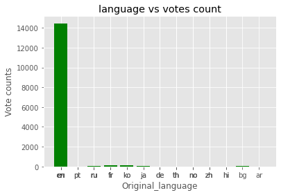
    


'''

Here we can see that movies made in English are more appealing to the target audience compared to other languages.

'''


```python

```


```python
lang = (rev.original_language)
vote = rev.vote_average
count = reviews.vote_count
fig, ax1 = plt.subplots(figsize=(8, 8))
ax2 = ax1.twinx()

import matplotlib.pyplot as plt
%matplotlib inline
plt.style.use('ggplot')

x = lang


x_pos = [i for i, _ in (x)]

plt.bar(x_pos, vote, color='green')
plt.xlabel("Original language")
plt.ylabel("Average votes")
plt.title("language vs average votes")

plt.xticks(x_pos, x)
# plt.savefig('language vs average vote.png')
plt.show()

```


    
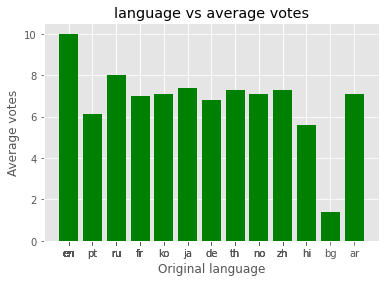
    


```python
'''
Based on the above analysis we see that the average votes conducted
are more favourable to the English language hence movies produced in English 
have a high approval among the target audience.
'''
```


    '\nBased on the above analysis we see that the average votes conducted\nare more favourable to the English language hence movies produced in English \nhave a high approval among the target audience.\n'


```python

```

### Correlation of the data

### Analysis based on Runtime


```python

```


```python
boxprops = dict(linestyle='--', linewidth=3, color='darkgoldenrod')
flierprops = dict(marker='o', markerfacecolor='green', markersize=12,
                  markeredgecolor='none')
medianprops = dict(linestyle='-.', linewidth=2.5, color='firebrick')
meanpointprops = dict(marker='D', markeredgecolor='black',
                      markerfacecolor='firebrick')
meanlineprops = dict(linestyle='--', linewidth=2.5, color='purple')
fs = 10 
plt.figure(figsize=(30,9))
sns.boxplot(y = 'rating', x="runtime", data = rt,meanprops=meanlineprops,meanline=False, showmeans=True)
plt.title("Boxplot for runtime", fontsize=fs)
# plt.savefig('rating vs runtime.jpg')
plt.show()

```


    
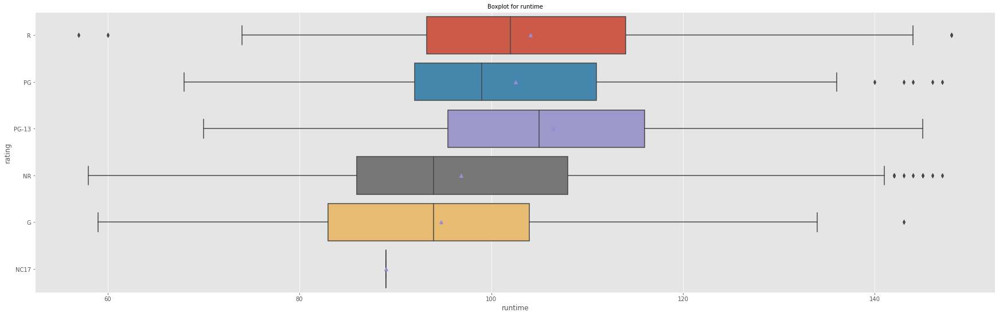
    


```python

```

### Analysis based on Vote Count and Vote Average


```python
import matplotlib.cm as cm
votes = rev.vote_average
counts = rev.vote_count
plt.figure(figsize=(14, 8))
plt.scatter(lang, vote, cmap = cm.brg)
plt.scatter(lang, counts, cmap = cm.brg)
plt.xlabel("language", size=2)
plt.ylabel("votes_avg", size=14)
plt.tick_params(axis='x', which='major', labelsize=6)
plt.show()
```


    
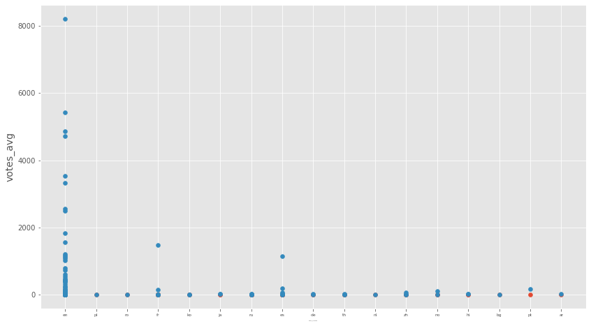
    


### Analysis based on Time(years)


```python
from matplotlib import colors
from matplotlib.ticker import PercentFormatter

fig, axs = plt.subplots(1,1,figsize=(10,9),tight_layout=True)
# Remove axes splines
for s in ['top', 'bottom', 'left', 'right']:
    axs.spines[s].set_visible(False)
 # Remove x, y ticks
axs.xaxis.set_ticks_position('none')
axs.yaxis.set_ticks_position('none')
   
# Add padding between axes and labels
axs.xaxis.set_tick_params(pad = 5)
axs.yaxis.set_tick_params(pad = 10)
 
# Add x, y gridlines
axs.grid(b = True, color ='grey',
        linestyle ='-.', linewidth = 0.5,
        alpha = 0.6)

N, bins, patches = axs.hist(x, edgecolor='black')
# Setting color
fracs = ((N**(1 / 5)) / N.max())
norm = colors.Normalize(fracs.min(), fracs.max())
 
for thisfrac, thispatch in zip(fracs, patches):
    color = plt.cm.viridis(norm(thisfrac))
    thispatch.set_facecolor(color)
axs.set_title('Movie Production Per Year')
axs.set_xlabel('years')
axs.set_ylabel('fequency')
# plt.savefig('movie production in different years.jpg')
```


    Text(0, 0.5, 'fequency')


    
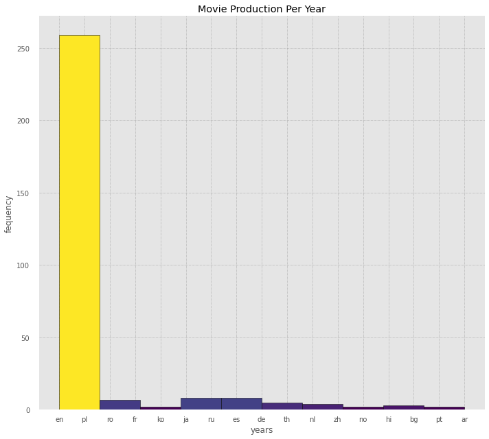
    


### Analysis based on the Released Date("Year")

### Distribution of worldwide gross revenue and production budget


```python
import matplotlib.cm as cm
y_axis = round(((budgets.worldwide_gross) / 100000000))
l_axis = round(((budgets.production_budget) / 100000000))
fig=plt.figure()
ax=fig.add_axes([0,0,1,1])
ax.scatter(budgets.worldwide_gross, budgets.production_budget, cmap = cm.brg)
# ax.scatter(bip, l_axis, cmap = cm.brg)
ax.set_xlabel('sales_range')
ax.set_ylabel('movies')
ax.set_title('scatter plot')
# plt.savefig('production_budget vs worldwide_gross.jpg')
plt.show()

```


    
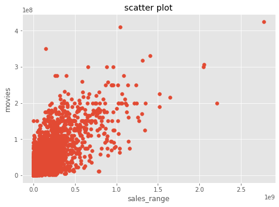
    


### Relationship between popularity and vote counts


```python
fig=plt.figure()
ax=fig.add_axes([0,0,1,1])
ax.scatter(reviews.popularity, reviews.vote_count, cmap = cm.brg)
# ax.scatter(bip, l_axis, cmap = cm.brg)
ax.set_xlabel('sales_range')
ax.set_ylabel('movies')
ax.set_title('scatter plot')
# plt.savefig('relationship between popularity and vote_count.jpg')

plt.show()

```


    
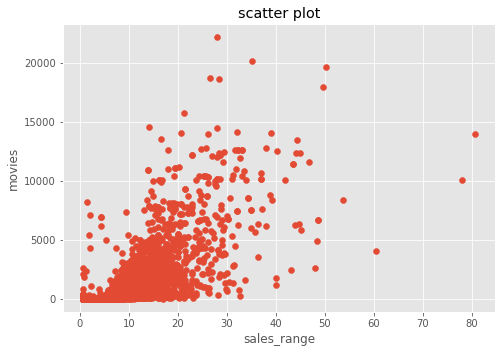
    


```python
fig=plt.figure()
ax=fig.add_axes([0,0,1,1])
ax.scatter(reviews.popularity, reviews.vote_count, cmap = cm.brg)
ax.scatter(budgets.worldwide_gross, budgets.production_budget, cmap = cm.brg)
# ax.scatter(bip, l_axis, cmap = cm.brg)
ax.set_xlabel('sales_range')
ax.set_ylabel('movies')
ax.set_title('scatter plot')
# plt.savefig('relationship between popularity and vote_count.jpg')

plt.show()
```


    
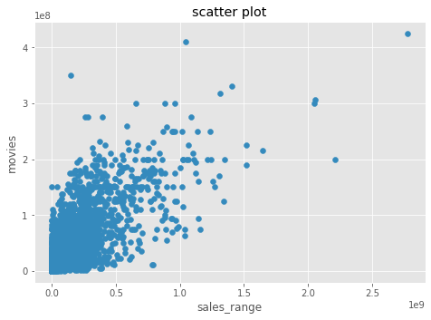
    


## Distribution of Languages based on frequency

## Movie Production Per Year


```python
x = gip
fig, ax = plt.subplots()
ax.hist(x, edgecolor='black', color = 'blue')
ax.set_title('Movie Production Per Year')
ax.set_xlabel('years')
ax.set_ylabel('fequency')
```


    Text(0, 0.5, 'fequency')


    
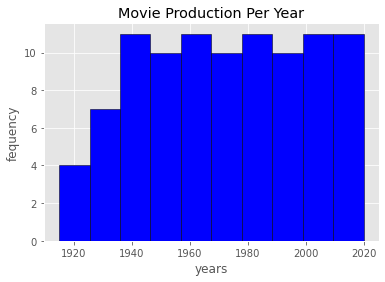
    


## Rating vs vote count

## Analysis Based on the Relationship between language, domestic gross and worldwide gross


```python
sns.scatterplot(x = rt.rating, y = budgets.domestic_gross)
```


    <AxesSubplot:xlabel='rating', ylabel='domestic_gross'>


    
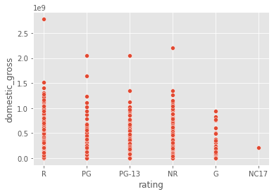
    


```python
import matplotlib.pyplot as plt
%matplotlib inline
plt.style.use('ggplot')
yes = budgets.domestic_gross.sample(300)
x = lang


x_pos = [i for i, _ in (x)]

plt.bar(x_pos, yes, color='green')
plt.xlabel("Original language")
plt.ylabel("revenue")
plt.title("language vs revenue")

plt.xticks(x_pos, x)
# plt.savefig('revenue vs language.jpg')
plt.show()
```


    
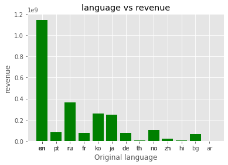
    


```python
import matplotlib.pyplot as plt
%matplotlib inline
plt.style.use('ggplot')
bull = budgets.worldwide_gross.sample(300)
x = lang


x_pos = [i for i, _ in (x)]

plt.bar(x_pos, yes, color='green')
plt.xlabel("Original language")
plt.ylabel("Revenue")
plt.title("language vs revenue")

plt.xticks(x_pos, x)
# plt.savefig('worlwide gorss vs language.jpg')
plt.show()
```


    

    


## Relationship between rating and meta score

## Relationship between rating and runtime


```python
# pimp your plot with the seaborn style
import seaborn as sns
sns.set_theme()
y = net.IMDB_Rating.sample(40)
x = net.Runtime.sample(40)
# plot
plt.scatter(x, y, c="green", alpha=0.4, linewidth=6)
 
# Add titles (main and on axis)
plt.xlabel("the X axis")
plt.ylabel("the Y axis")
plt.title("A bubble plot", loc="left")
plt.savefig(' bubble plot rating vs runtime.jpg')
# show the graph
plt.show()
```


    
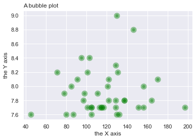
    


# Recommendation
* The longest movie should last 148 minutes.
* Movies should be made with different markets in mind.
* Languge used is a key factor in terms of sales given movies in English sell more than others.
* Movie production in the last two decades has been an all time high.


#  Conclusion
With movie production at an all time high in the last two decades even to this year, this is the perfect time to join the fun.
